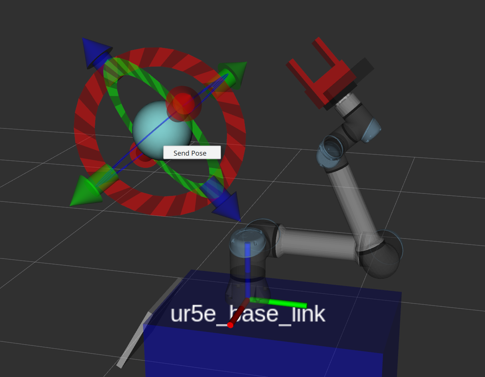

# Cartesian Trajectory Generator

A simple trajectory generator that creates and publishes a linear trajectory in Cartesian space.

## Features:
- Publish a linear trajectory based on the current pose of a frame and a goal
- Optional synchronization of rotation and translation
- Implements a velocity profile with
  - User-defined separate values for constant acceleration and deceleration
  - Maximum rotational and translational velocity
- Allows implementation of other velocity profiles
- dynamic reconfigure configuration

## Limitations:
- No collision checks
- No feasibility checks
- No handling of existing velocity of the end effector

## How to use:
Open three terminals:

1. $ `roscore`
2. $ `mon launch cartesian_trajectory_generator publisher_demo.launch`
3. $ `mon launch cartesian_trajectory_generator trajectory_generator.launch`

The demo will use three topics:
1. `/cartesian_trajectory_generator/current_goal`: Publishes the current goal
2. `/cartesian_trajectory_generator/new_goal`: Accepts new goals
3. `/cartesian_trajectory_generator/ref_pose`: Publishes the current reference pose

## Update the Goal
### With Dynamic Reconfigure

$ `rosrun rqt_reconfigure rqt_reconfigure`

In the rqt-gui open the menu for this pakcage, choose a new goal pose and click the "ready_to_send" button.

### With messages
You can send new goal to `/cartesian_trajectory_generator/new_goal` like this:
```
$ rostopic pub /cartesian_trajectory_generator/new_goal geometry_msgs/PoseStamped "header:
  seq: 0
  stamp:
    secs: 0
    nsecs: 0
  frame_id: 'world'
pose:
  position:
    x: 0.0
    y: 0.0
    z: 2.0
  orientation:
    x: 0.0
    y: 0.0
    z: 0.0
    w: 1.0"
```

### With RViz
This package publishes an interactive marker. You can move it to your desired goal pose. A right click opens a context menu that has an option "Send Pose".

The marker position is updated when new goals arrive via messages or dynamic reconfigure.


### With an action
The ROS node will spawn an action server at `/cartesian_trajectory_generator/goal_action` that can be used to send an action.

The action will succeed once the reference trajectory has finished and the end-effector is below both the specified `trans_goal_threshold` and `rot_goal_threshold`.

## Apply an Overlay Motion

The trajectory generator announces a service at `/cartesian_trajectory_generator/overlay_motion`.

An example call can look like this:

```
rosservice call /cartesian_trajectory_generator/overlay_motion "header:
  seq: 0
  stamp: {secs: 0, nsecs: 0}
  frame_id: 'world'
motion: 1
radius: 0.2
path_distance: 0.01
path_velocity: 0.1
allow_decrease: false
dir: {x: 0.0, y: 0.0, z: 1.0}"
```

The static values for the motion are defined in the [service message definition](srv/OverlayMotion.srv).

### Cancelling an Overlay Motion

A call with `motion = 0`, that corresponds to `NONE` in the service message definition, or an invalid value will cancel the current motion.\
The reference pose will smoothly transition back to the last goal.